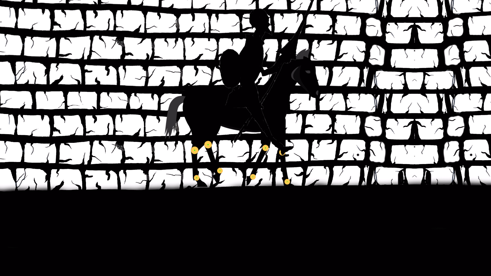

# UCLA-GameLab-Portfolio
This repository showcases the four projects I created during the **UCLA Game Lab Summer Institute (Session A, 2023)**.   These works explore rapid prototyping, level design, gameplay systems, narrative mechanics, and animation across both digital and analog formats.

The official UCLA archive:  
https://si.games.ucla.edu/2023/session-a/  
*(My projects appear on this page under their respective titles.)*

---

## 1. **The Cure – Board/Card Game**
A full tabletop game designed over the course of the program, including:
- Custom player roles and attribute systems  
- Monster and trap mechanics  
- Fully illustrated map  
- Complete rulebook and print-ready card sheets  

**PDF:**  
[View The Cure](./the-cure-board-game/The_Cure.pdf)

---

## 2. **3D Unreal Engine Game**
A short narrative-driven 3D experience built in **Unreal Engine**, focusing on:
- Environment design  
- Blueprint scripting for player interaction  
- Lighting, pacing, and worldbuilding  
- Iterative level layout and storytelling through space  

**Gameplay Video:**  
[Watch 3D Unreal Game](./3d-unreal-game/gameplay.mp4)

---

## 3. **2D Unreal Engine Game**
A 2D experimental platformer built with Unreal Engine’s Paper2D pipeline. Highlights:
- Custom movement system  
- Blueprint-based mechanics  
- Hand-made sprites and VFX  
- Tight iteration loop for game feel and responsiveness  

**Gameplay Video:**  
[Watch 2D Unreal Game](./2d-unreal-game/gameplay.mp4)

---

## 4. **Horse Animation – Motion Study**
A motion and silhouette study completed as part of UCLA’s animation exercises.
This project focused on:
- Conveying motion through minimal forms  
- Character + mount silhouette rhythm  
- Pose readability and timing exploration  

**Frame Preview:**  

---

## Tools Used
- **Unreal Engine (Blueprints + Level Design)**
- **Photoshop / After Effects / Illustrator**
- **Traditional drawing + digital sketch workflows**
- **Rulebook design + tabletop prototyping**

---

## About This Portfolio
Some original project files were stored on UCLA’s servers and are no longer accessible.  
This repository provides:
- Full PDFs where available  
- Video captures of interactive projects  
- Screenshots for animation studies  
- Documentation for each project’s design intent  

